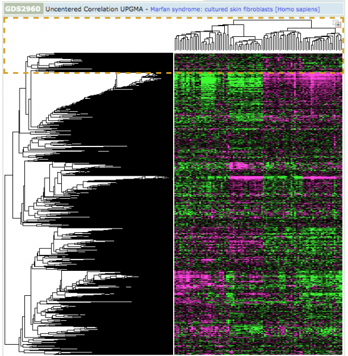
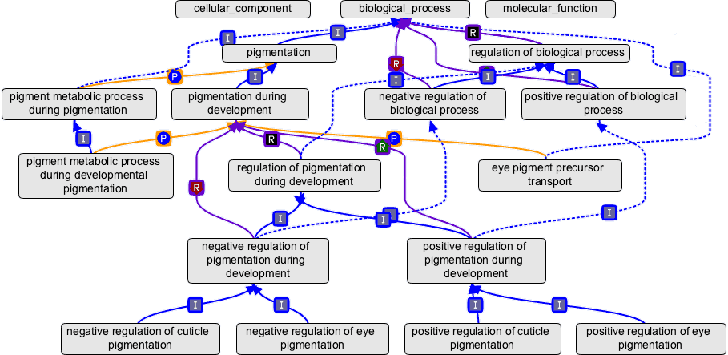

% Functional Genomics
% David Montaner
% [www.dmontaner.com](http://www.dmontaner.com)

Genes and Functions
--------------------------------------------------------------

Experimental Data: Microarrays & NGS
--------------------------------------------------------------

Annotation Data Bases - Gene Ontology
--------------------------------------------------------------

GSEA
==============================================================

Differential Gene expression
--------------------------------------------------------------

Equations
--------------------------------------------------------------

$$ r = - sign (statistic) \cdot log (pvalue) $$

mas

$$ t_i = \sum_{j \in G_i} r_{j} $$

mas

$$ \log \frac{P(g_i \in F)}{P (g_i \notin F)} = \kappa + \alpha \ t_i $$

Mas eq
--------------------------------------------------------------

\begin{equation}
\begin{split}
F = \{F_{x} \in  F_{c} &: (|S| > |C|) \\
 &\quad \cap (\text{minPixels}  < |S| < \text{maxPixels}) \\
 &\quad \cap (|S_{\text{conected}}| > |S| - \epsilon) \}
\end{split}
\end{equation}

And so... Summary
==============================================================

It was fun
--------------------------------------------------------------

... and useful
 
- New methodology and tools are available 
- My PhD
- Supervised one more PhD and several MSc disertations
- Teaching and communication  
  [www.dmontaner.com/#Short Bioinformatics Courses](http://www.dmontaner.com/#Short%20Bioinformatics%20Courses)

+50 Publications _(peer review)_
--------------------------------------------------------------

- _Integrated gene set analysis for microRNA studies._ Garcia-Garcia F, Panadero J, Dopazo J, **Montaner D**. [Bioinformatics (Oxford, England). 2016; ](http://www.ncbi.nlm.nih.gov//pubmed/27324197)
- _Multidimensional gene set analysis of genomic data._ **Montaner D**, Dopazo J. [PloS one. 2010; 5(4):e10348.](http://www.ncbi.nlm.nih.gov//pubmed/20436964)
- _Gene set internal coherence in the context of functional profiling._ **Montaner D**, Minguez P, Al-Shahrour F, Dopazo J. [BMC genomics. 2009; 10:197.](http://www.ncbi.nlm.nih.gov//pubmed/19397819)

--------------------------------------------------------------

- _Babelomics 5.0: functional interpretation for new generations of genomic data._ Alonso R, et al. [Nucleic acids research. 2015; 43(W1):W117-21.](http://www.ncbi.nlm.nih.gov//pubmed/25897133)
- _Prophet, a web-based tool for class prediction using microarray data._ Medina I, **Montaner D**, Tárraga J, Dopazo J. [Bioinformatics (Oxford, England). 2007; 23(3):390-1.](http://www.ncbi.nlm.nih.gov//pubmed/17138587)
- _Next station in microarray data analysis: GEPAS._ **Montaner D**, et al. [Nucleic acids research. 2006; 34(Web Server issue):W486-91.](http://www.ncbi.nlm.nih.gov//pubmed/16845056)

[www.dmontaner.com/#Papers](http://www.dmontaner.com/#Papers)

Software
--------------------------------------------------------------

- http://bioconductor.org/packages/mdgsa
- http://bioconductor.org/packages/SNPediaR
- https://github.com/dmontaner/mirbaseID
- https://github.com/genometra/agilent
- https://cran.r-project.org/web/packages/TiddlyWikiR - [ex](http://dmontaner-papers.github.io/gsa4mirna)

- http://babelomics.org

Knowledge Transfer
--------------------------------------------------------------

[www.genometra.com](http://www.genometra.com)

First [CIPF](https://www.cipf.es/web/portada/spinoffs;jsessionid=C2DE665D4DFEE112095BB7B311E1A7A3) Spin-off Compny

What can I add to you
==============================================================
--------------------------------------------------------------

- Statistics & Machine Learning
- Theory + applyed skills + statistical intuition
- Used to solve _whole_ problems: beyond the analysis side
- Team woking

----

- Training and teaching 
- Convincing and explaining 
- Sharing

