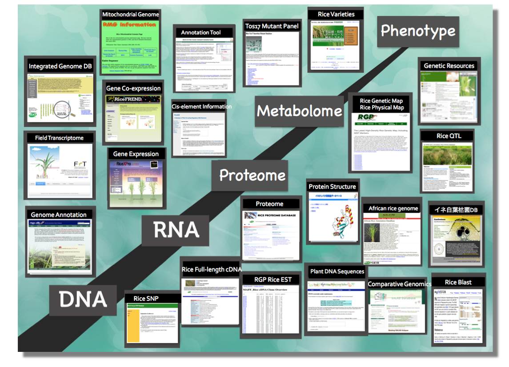

% Functional Genomics
% David Montaner
% [www.dmontaner.com](http://www.dmontaner.com)

Genes and Functions
--------------------------------------------------------------

Experimental Data: Microarrays & NGS
--------------------------------------------------------------

Annotation Data Bases - Gene Ontology
--------------------------------------------------------------

GSEA
==============================================================

Differential Gene expression
--------------------------------------------------------------

Equations
--------------------------------------------------------------

En el texto $a != 0$ 

En el texto $a^{0.0}$ 

En el texto $a \ne 0$ 

$$r = - sign (statistic) \cdot log (pvalue)$$

$r = - sign (statistic) \cdot log (pvalue)$

\begin{equation}
r = - sign (statistic) \cdot log (pvalue)
\end{equation}

When `a != 0`, there are two solutions to `ax^2 + bx + c = 0` and

`x = (-b +- sqrt(b^2-4ac))/(2a) .`

Mas eq
--------------------------------------------------------------

\begin{equation}
\begin{split}
F = \{F_{x} \in  F_{c} &: (|S| > |C|) \\
 &\quad \cap (\text{minPixels}  < |S| < \text{maxPixels}) \\
 &\quad \cap (|S_{\text{conected}}| > |S| - \epsilon) \}
\end{split}
\end{equation}

Summary
==============================================================

- PhD & +50 publications

What can I add to you
==============================================================

--------------------------------------------------------------

- Statistics & Machine Learning
- Theory + applyed skills + statistical intuition
- Used to solve _whole_ problems: beyond the analysis side
- Team woking

----

- Training and teaching 
- Convincing and explaining 
- Sharing

<!--  -->

<!--  -->

<!--  -->
