% Functional Genomics
% David Montaner
% [www.dmontaner.com](http://www.dmontaner.com)

From Genes to Phenotype
==============================================================

--------------------------------------------------------------


--------------------------------------------------------------


--------------------------------------------------------------

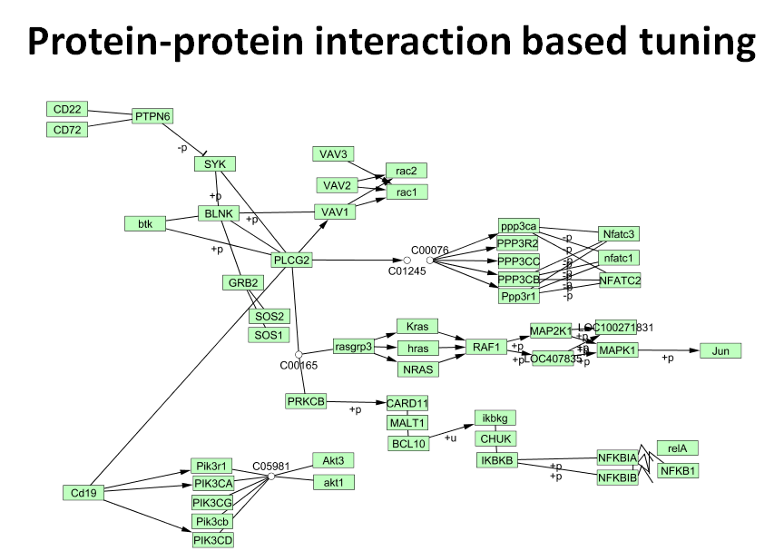

--------------------------------------------------------------


--------------------------------------------------------------


Annotation Data Bases - Gene Ontology
--------------------------------------------------------------


--------------------------------------------------------------


Experimental Data: Microarrays & NGS
--------------------------------------------------------------

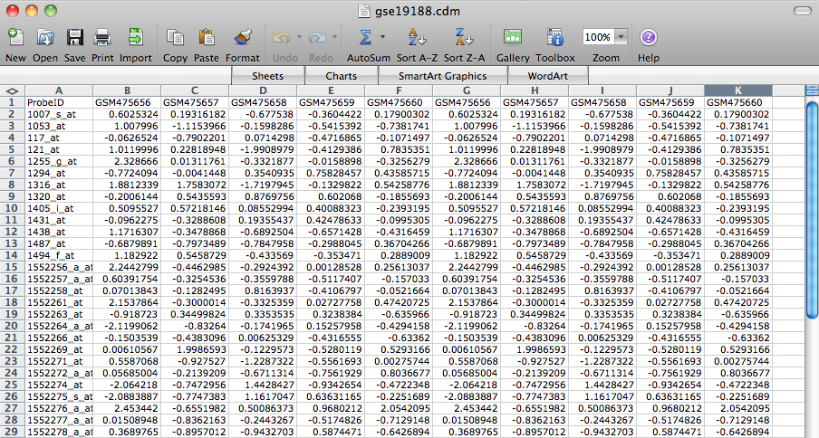

thousands or millions of genomic _variables_

--------------------------------------------------------------


Gene Expression Analysis
==============================================================

Clustering
--------------------------------------------------------------


Class prediction
--------------------------------------------------------------

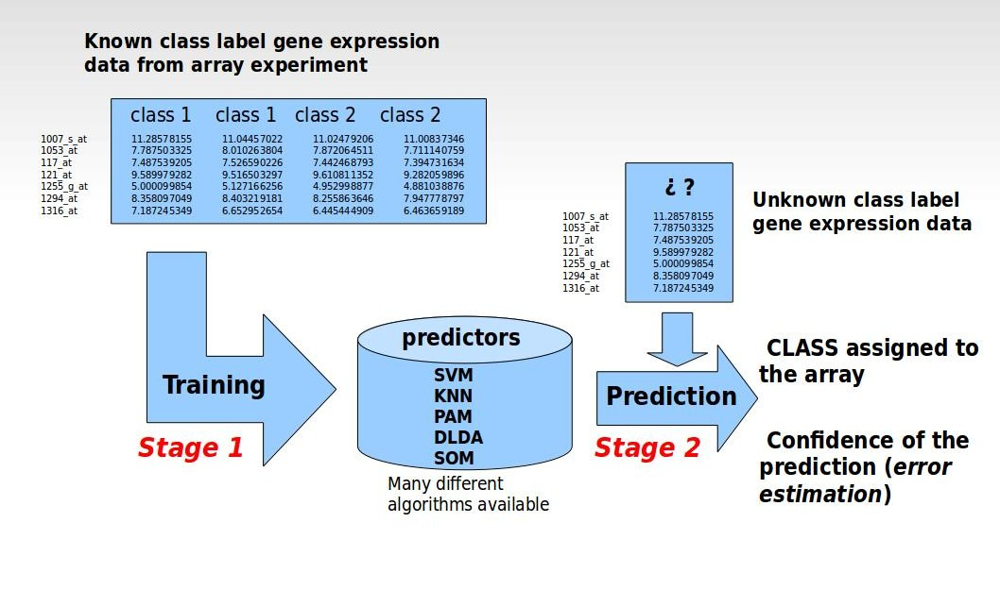


Hypothesis testing
--------------------------------------------------------------

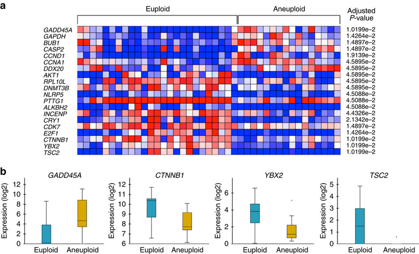

--------------------------------------------------------------


Gene Set Analysis
==============================================================

--------------------------------------------------------------

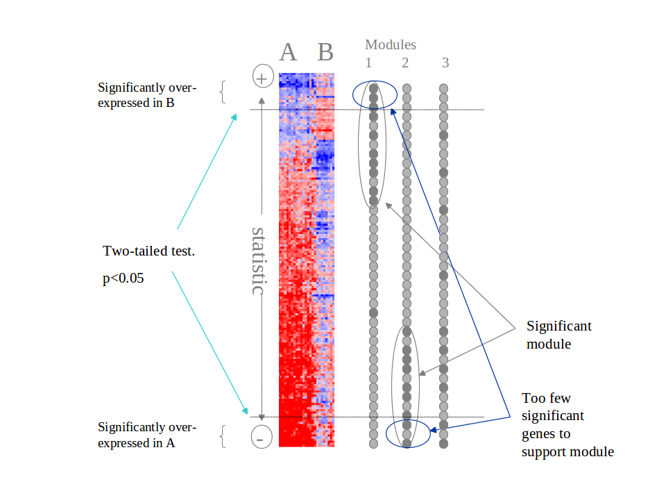


Shift in the observation unit
--------------------------------------------------------------

- $H_0: gene_i$ is not differentially expressed ...
- $H_0: gene\ set_j$ is not __enriched__ ... 

<hr>

1. more interpretable for researchers
1. greater power (sample size )
1. smaller p-value adjustment:  
   20,000 genes -> 2,000 GO terms

Takes advantage of the mildly differentially expressed genes

GSEA
--------------------------------------------------------------


Drawbacks
--------------------------------------------------------------

- Confidence level based on a __sample__ _permutation_ test.  
  Computationally intensive.
- Completely dependent of the gene level statistic.  
  Not very flexible: weighting, covariates, ...
- Tackles just a single _genomic dimension_


Genomic dimensions
--------------------------------------------------------------

- Gene expression
- Transcript expression
- Splicing
- microRNA activity
- Promoters
- Methylation
- SNV (genetic variation)
- Copy Number
- Loss of heterozygosity (LOH)


Logistic Regression Model
==============================================================

--------------------------------------------------------------

$$ \log \frac{P(g_i \in GO)}{P (g_i \notin GO)} = \kappa + \alpha \ r_i $$

\  

We model the probability of a gene belonging to a GO term  
as a function of its _score_  
in the differential expression analysis

--------------------------------------------------------------


--------------------------------------------------------------

$$ \log \frac{P(g_i \in GO)}{P (g_i \notin GO)} = \kappa + \alpha \ r_i $$

\  

\begin{align}
&\alpha > 0 \rightarrow \text{enrichment is } + \\
&\alpha < 0 \rightarrow \text{enrichment is } - \\
&\alpha = 0 \rightarrow \text{no enrichment}
\end{align}


Ranking index
--------------------------------------------------------------

Our proposal: 

$$ r = - sign (statistic) \cdot log (pvalue) $$

makes results more comparable across different studies  
(good for meta analysis)

_quantiles_ transformation to a $N(0,1)$  
reduces the effect of outliers

\  

But any continuous value can be used... 


Multi Dimensional Gene Set Analysis
==============================================================

Genomic dimensions
--------------------------------------------------------------

- Gene expression
- Transcript expression
- Splicing
- microRNA activity
- Promoters
- Methylation
- SNV (genetic variation)
- Copy Number
- Loss of heterozygosity (LOH)

--------------------------------------------------------------

- Study several diseases / datasets at the same time
- Gene conservation in evolution
- Text mining information: genes vs. treatments
- Some other physical characteristics: gene length

--------------------------------------------------------------


Multidimensional Logistic Regression
--------------------------------------------------------------

\  

$$ \log \frac{P(g_i \in GO)}{P (g_i \notin GO)} = \kappa + \alpha\ x_1 + \beta\ x_2 $$

--------------------------------------------------------------

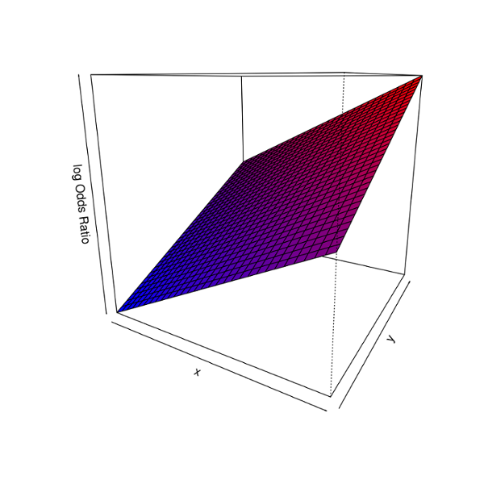


Interaction 
--------------------------------------------------------------

\  

$$ \log \frac{P(g_i \in GO)}{P (g_i \notin GO)} = \kappa + \alpha\ x_1 + \beta\ x_2 + \gamma\ x_1  x_2 $$

--------------------------------------------------------------

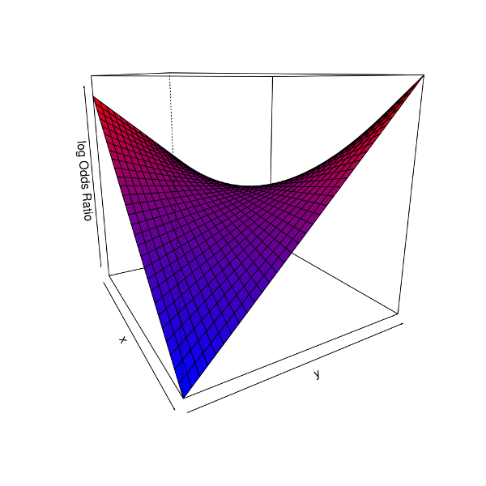

--------------------------------------------------------------


--------------------------------------------------------------


--------------------------------------------------------------


Interpretation
--------------------------------------------------------------

\  

$$ \log \frac{P(g_i \in GO)}{P (g_i \notin GO)} = \kappa + \alpha\ x_1 + \beta\ x_2 + \gamma\ x_1  x_2 $$

--------------------------------------------------------------

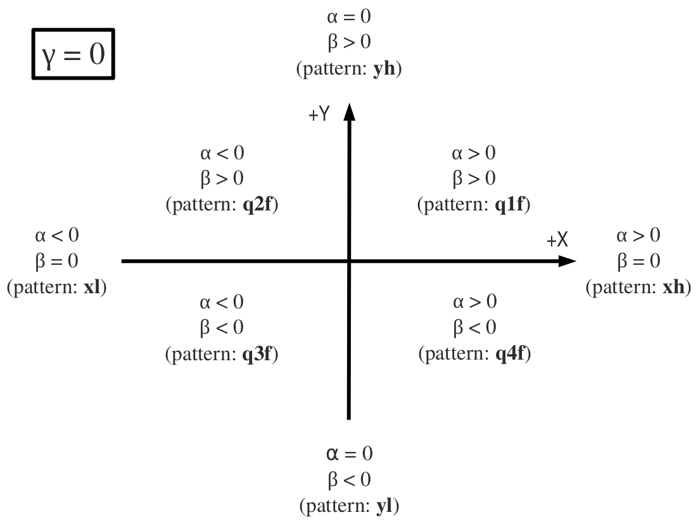

--------------------------------------------------------------

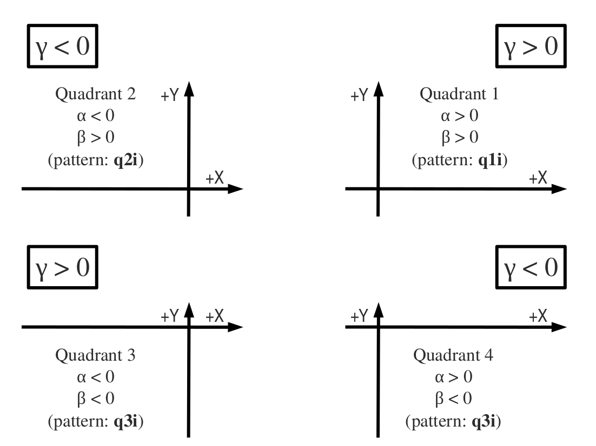

--------------------------------------------------------------

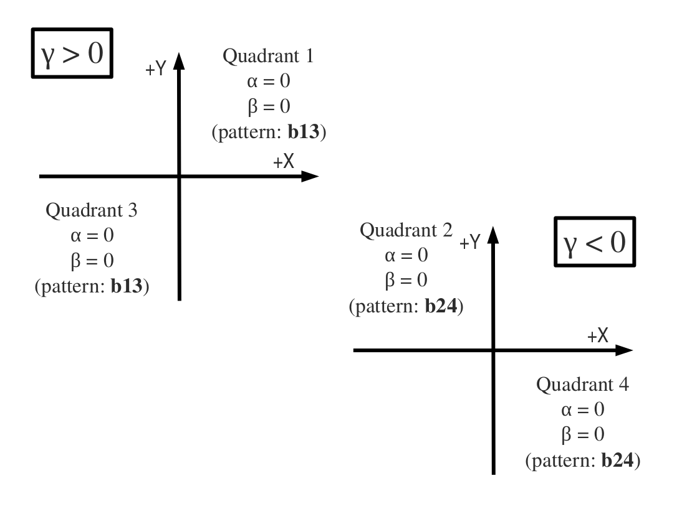


Extensions
==============================================================

microRNAs
--------------------------------------------------------------

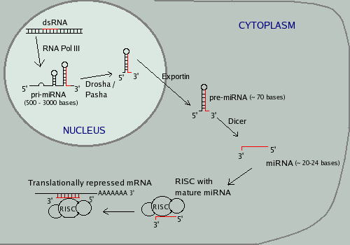


Target genes
--------------------------------------------------------------

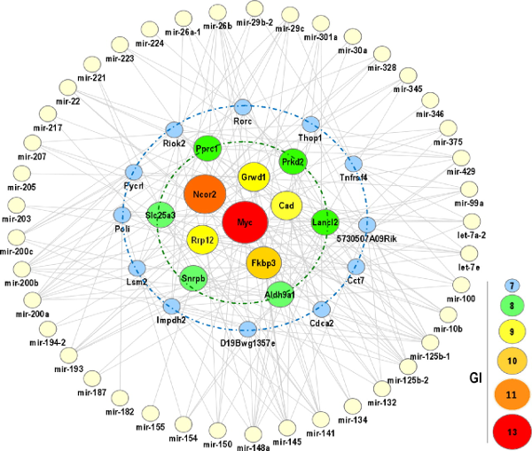


Biological function
--------------------------------------------------------------

```
                              Function (GO)
                               /      \
+ gene expression  -> + protein -> + biological activity
                    ^
                    |
+ miRNA expression -> - protein -> - biological activity
                               \      / 
                              Function (GO)
```

- miRNA protein inhibition through _target_ genes
- Functionality is _annotated_ to genes: GO db
- miRNAs _target_ certain genes: miRTarBase db


All information converges at a gene level  
where the functional interpretation can be done.


microRNA to gene transference
--------------------------------------------------------------

$$ t_i = \sum_{j \in GT_i} r_{j} $$

- $r_{j}$ ranking statistic for miRNA $j$
- $GT_i$ set of miRNAs targeting gene $i$
- $t_{i}$ ranking statistic for gene $i$: __inhibition score__

Additive (or subtractive) score: simple but efficient model


Plug into the logistic model
--------------------------------------------------------------

\  

$$ \log \frac{P(g_i \in GO)}{P (g_i \notin GO)} = \kappa + \alpha\ x_1 + \beta\ x_2 + \gamma\ x_1  x_2 $$

\  

$$ \log \frac{P(g_i \in GO)}{P (g_i \notin GO)} = \kappa + \alpha\  t  + \beta\ x_2 + \gamma\  t   x_2 $$


Unidimensional case
--------------------------------------------------------------

\  

$$ \log \frac{P(g_i \in GO)}{P (g_i \notin GO)} = \kappa + \alpha \ r_i $$

\  

$$ \log \frac{P(g_i \in GO)}{P (g_i \notin GO)} = \kappa + \alpha \ t_i $$


--------------------------------------------------------------

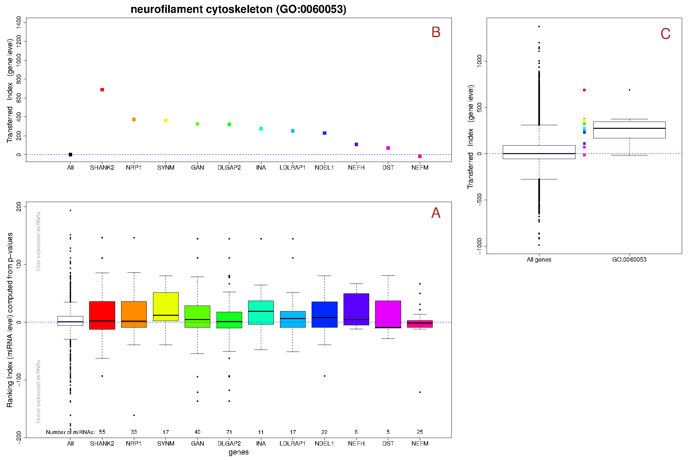

--------------------------------------------------------------

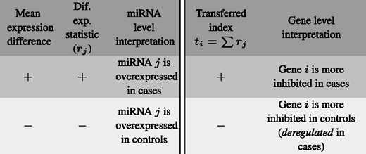

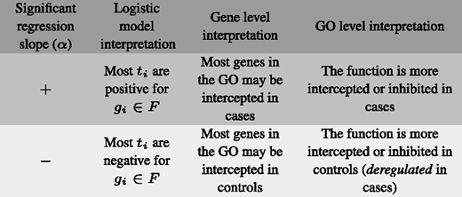


Some more Extensions
==============================================================

--------------------------------------------------------------

- Weighting methods: gene importance
- Gene to GeneSet empirical distance
- Gene set internal Correlation
- Meta analysis: combining results from several studies
- Supervised   Classification using enriched GeneSets
- Unsupervised Classification
- Much more work in data preprocessing and validation
- Account for technological biases: gene length NGS
- Organization and presentation of results:  
  thousands of tables, images, plots


And so... 
==============================================================

It was fun
--------------------------------------------------------------

... and useful
 
- New methodology and tools are available 
- I did my PhD
- I supervised one more PhD and several MSc dissertations
- Teaching and communication  
  [www.dmontaner.com/#Short Bioinformatics Courses](http://www.dmontaner.com/#Short%20Bioinformatics%20Courses)


+50 Publications _(peer review)_
--------------------------------------------------------------

- _Integrated gene set analysis for microRNA studies._ Garcia-Garcia F, Panadero J, Dopazo J, **Montaner D**. [Bioinformatics (Oxford, England). 2016; ](http://www.ncbi.nlm.nih.gov//pubmed/27324197)
- _Multidimensional gene set analysis of genomic data._ **Montaner D**, Dopazo J. [PloS one. 2010; 5(4):e10348.](http://www.ncbi.nlm.nih.gov//pubmed/20436964)
- _Gene set internal coherence in the context of functional profiling._ **Montaner D**, Minguez P, Al-Shahrour F, Dopazo J. [BMC genomics. 2009; 10:197.](http://www.ncbi.nlm.nih.gov//pubmed/19397819)

--------------------------------------------------------------

- _Babelomics 5.0: functional interpretation for new generations of genomic data._ Alonso R, et al. [Nucleic acids research. 2015; 43(W1):W117-21.](http://www.ncbi.nlm.nih.gov//pubmed/25897133)
- _Prophet, a web-based tool for class prediction using microarray data._ Medina I, **Montaner D**, Tárraga J, Dopazo J. [Bioinformatics (Oxford, England). 2007; 23(3):390-1.](http://www.ncbi.nlm.nih.gov//pubmed/17138587)
- _Next station in microarray data analysis: GEPAS._ **Montaner D**, et al. [Nucleic acids research. 2006; 34(Web Server issue):W486-91.](http://www.ncbi.nlm.nih.gov//pubmed/16845056)

[www.dmontaner.com/#Papers](http://www.dmontaner.com/#Papers)


Software
--------------------------------------------------------------

- http://bioconductor.org/packages/mdgsa
- http://bioconductor.org/packages/SNPediaR
- https://github.com/dmontaner/mirbaseID
- https://github.com/genometra/agilent
- https://cran.r-project.org/web/packages/TiddlyWikiR  
  [wiki example](http://dmontaner-papers.github.io/gsa4mirna)
 
http://babelomics.org


Knowledge Transfer
--------------------------------------------------------------


[www.genometra.com](http://www.genometra.com)

First [CIPF](https://www.cipf.es/web/portada/spinoffs;jsessionid=C2DE665D4DFEE112095BB7B311E1A7A3) Spin-off Company


& ? 2 u
==============================================================
--------------------------------------------------------------

- Statistics & Machine Learning
- Theory + applied skills + statistical intuition
- Wide computational skills
- Problem solver: beyond data analysis
- Problem finder: new questions
- Team building
- Training and teaching (colleagues and myself)
- Reporting and communicating
- Collaborating (open source)
- Risk taking...


Risk is Risk...
--------------------------------------------------------------

... in Finances or Biology

Thank you!
--------------------------------------------------------------
